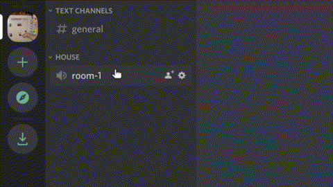
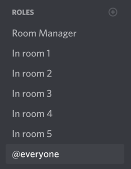

A discord bot that allows you to assign roles to users when they are in a particular voice chat. By giving permissions to these roles to see other voice/text channels, you can create text-based adventures, virtual spaces to host parties, or DnD servers that don't become cluttered with text chats.

# Setup

If you don't know how to set up a Discord bot, [Discordjs.guide](https://discordjs.guide/) is a great resource. 

Here are some other things to know:

- `config.js` is where you put the bot's private token, as well as the "rooms" (the roles to assign when you enter each voice channel)

- The only permission the bot requires is to manage roles

- The bot's role has to be above the roles that it assigns. Otherwise, it doesn't have the appropriate permissions

	- 

- For your desired effect, you have to manage what channels each role can see/do. This can be done in `Edit Channel > Permissions` for each channel

# TODO

- [ ] Have the bot remove roles on crashing
- [ ] Use a database, and save server-specific data so that bot can be in multiple servers
	- [ ] Build a sufficient command interface with the bot for server owners to set up with
